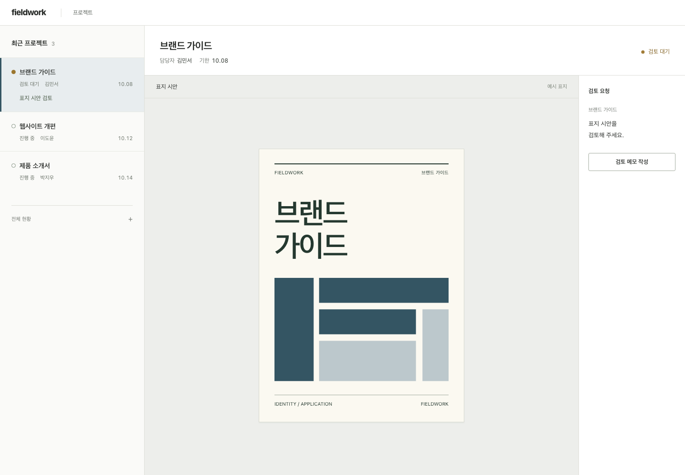
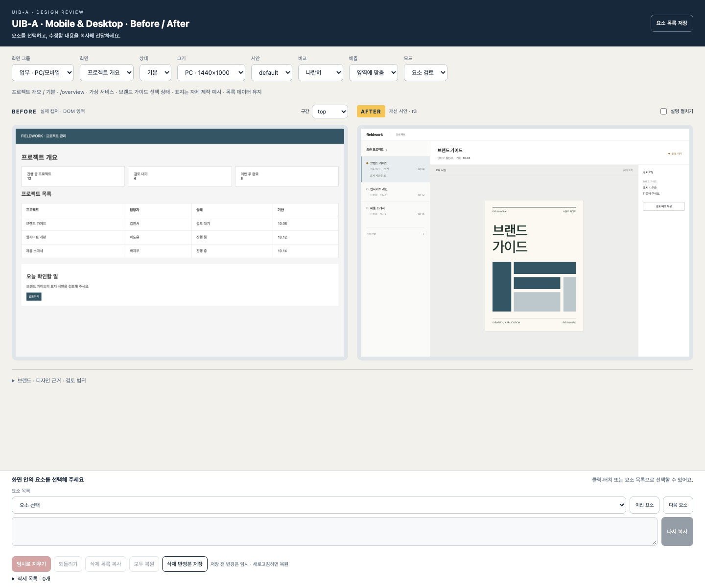
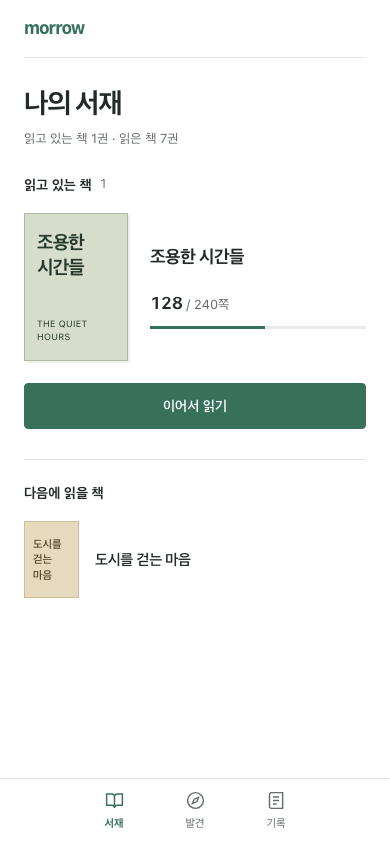
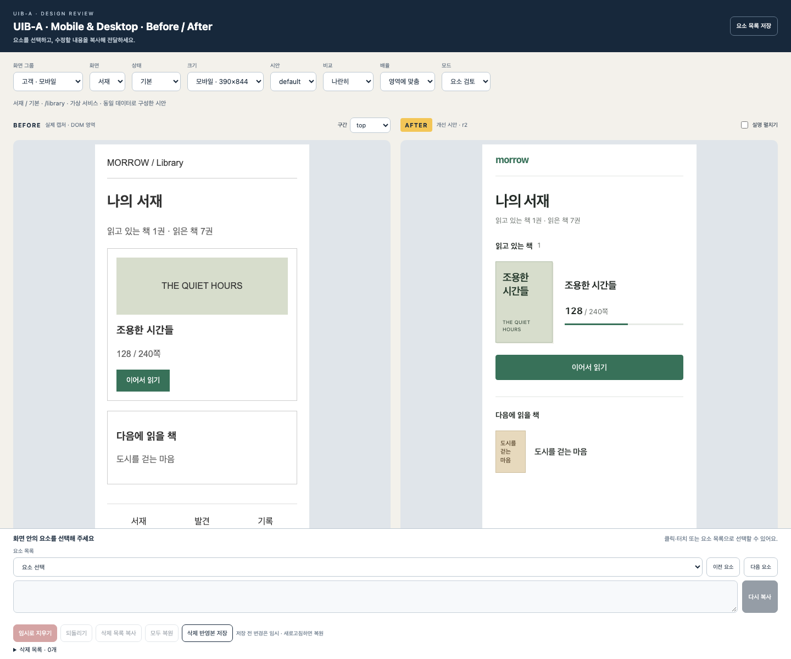

<div align="center">

# uib-a

### 기존 화면과 수정안을 한 HTML에서 비교

**현재 UI와 개선 시안을 하나의 HTML로**<br>
모바일·PC 시안 작성, 요소 선택·삭제·복원·저장용 Codex 스킬

[](LICENSE)
[](package.json)
[](SKILL.md)
[](#preview)

**한국어** · [English](README.en.md)

[미리 보기](#preview) · [빠른 시작](#quick-start) · [사용 예시](#prompts) · [검토 기능](#features) · [문서](#docs)

</div>

---

## uib-a 소개

`uib-a` = **UI Before / After**

- 프로젝트의 실제 화면·브랜드 파악
- 사용자의 다음 행동과 필요한 정보 확인
- Dribbble·실제 제품 화면에서 해당 과제에 맞는 배치 참고
- 기존 서비스의 데이터·용어·색을 기준으로 After 작성
- Before와 After를 함께 담은 독립 HTML 생성
- 선택 요소의 수정 요청 복사
- 요소 임시 삭제·복원·저장
- 저장본 기반 다음 시안 작업

```text
현재 프로젝트 + 브랜드 + 디자인 참고
                 ↓
       실제 Before / 개선 After
                 ↓
    요소 선택 → 삭제·복원 → HTML 저장
                 ↓
       저장본으로 다음 시안 다듬기
```

## 사용 목적

구현 전 배치·문구·동작 위치를 비교하기 위한 시안 제작

| 필요한 순간 | uib-a 활용 |
| --- | --- |
| 개발 전 디자인 방향 결정 | 제품 코드 변경 전 Before/After 검토 |
| 레퍼런스와 브랜드의 결합 | 구조·여백 참고 + 브랜드 색·문구·밀도 적용 |
| 모호한 수정 요청 | 요소 ID·화면·버전·위치 복사 |
| 덜어낼 요소 판단 | 요소 임시 삭제 + 주변 배치 확인 |
| 모바일·PC 동시 검토 | 실제 viewport별 시안 비교 |
| 리뷰어 환경 제약 | 브라우저에서 HTML 단독 실행 |

기본 산출물 = 디자인 시안<br>
제품 코드 반영 = 검토 후 별도 요청

### After 작성 기준

- 큰 카드·KPI 묶음·히어로를 기본 배치로 사용하지 않음
- 사용자 행동·정보 관계로 각 구역의 배치 이유 설명
- 장식용 영문·추상적인 안내·임의 아이콘·가짜 수치 제거
- 기존 브랜드에 필요한 색·이미지·서체는 근거를 확인해 유지
- 예시의 색과 레이아웃을 다른 프로젝트에 그대로 적용하지 않음
- [상세 설계 기준](references/product-design.md)

<a id="preview"></a>

## 미리 보기

### PC · 프로젝트 검토



<details>
<summary><strong>PC · Before/After 비교 도구</strong></summary>



</details>

<details>
<summary><strong>모바일 · 독서 앱 시안</strong></summary>





</details>

[데모 HTML 다운로드](https://raw.githubusercontent.com/99duuk/uib-a/main/docs/demo/before-after.html)

- 파일 저장 후 브라우저 실행
- 서버·Node.js 설치 불필요
- 모바일 서재·읽기 확인 모달·PC 프로젝트 홈·모바일 프로젝트 홈 포함
- 가상 브랜드 기반 기능 예시
- Dribbble 순위·전환 성과 사례 아님
- Before 이미지·데이터 유지, After 구성만 개정

| 예시 | 수정 내용 |
| --- | --- |
| 모바일 서재 | 표지 확대 영역 축소, 제목·읽은 위치·이어서 읽기 연결 |
| PC 프로젝트 검토 | 목록에서 선택한 프로젝트의 표지·검토 요청을 함께 표시 |
| 모바일 프로젝트 검토 | 프로젝트 목록 → 표지 → 검토 요청, 전체 현황 접기 |

[예시의 변경 이유·참고 자료](docs/design-notes.md)

<a id="quick-start"></a>

## 빠른 시작

### 준비물

- Codex
- Node.js 22 이상
- npm·Git
- 최초 의존성 설치·디자인 조사용 인터넷

### 1. 스킬 설치

```sh
git clone https://github.com/99duuk/uib-a.git
cd uib-a
npm run install:skill
```

- 기본 설치 경로: `$CODEX_HOME/skills/uib-a`
- `CODEX_HOME` 미설정 시: `~/.codex/skills/uib-a`
- 기존 폴더 자동 덮어쓰기 없음
- 사용자 지정 경로:

```sh
npm run install:skill -- /absolute/path/uib-a
```

### 2. 프로젝트에서 호출

새 Codex 대화에서 아래 프롬프트 사용

```text
$uib-a 고객 시작 화면과 PC 관리자 홈을 다시 봐줘.
실제 화면을 먼저 보고, 사용자가 해야 할 일과 찾기 어려운 정보를 짚어줘.
기존 데이터와 브랜드를 유지하면서 그 문제를 해결하는 시안을 만들어줘.
각 배치의 이유를 설명하고 Before/After를 한 HTML로 비교하게 해줘.
제품 코드는 수정하지 말고 HTML의 절대경로를 알려줘.
```

- 프로젝트 구조·화면 범위 확인
- Before 캡처·DOM 영역 매핑
- After 시안 작성
- 검토 HTML 경로 전달

### 3. HTML 검토

1. 전달받은 HTML 브라우저 실행
2. 화면·상태·크기 선택
3. Before/After 비교
4. 수정 요소 선택 후 **복사**
5. 필요 시 **임시 삭제 → 복원**
6. **삭제 반영본 저장**

생성 HTML = 서버 없는 오프라인 실행 파일

<a id="features"></a>

## 검토 기능

| 기능 | 동작 |
| --- | --- |
| 화면·상태 선택 | 그룹·화면·상태·viewport·variant 전환 |
| 비교 방식 | 나란히 보기·Before 단독·After 단독 |
| 크기 확인 | 맞춤·100% 배율 |
| 요소 선택 | 클릭·터치·키보드·요소 목록 |
| 상위 요소 선택 | 버튼·카드·섹션 등 부모 요소 이동 |
| 수정 요청 복사 | 화면·요소 ID·revision·위치 포함 |
| After 삭제 | DOM 숨김 + 레이아웃 재배치 |
| Before 삭제 | 캡처 영역 마스킹 |
| 복원 | 개별 복원·되돌리기·모두 복원 |
| 검토 저장 | 삭제 목록 복사 + 새 HTML 다운로드 |
| 후속 작업 | 저장본 추출·수정·revision 증가·재생성 |
| 로컬 체험 | 선언된 화면 전이 확인 |

### 저장 동작

- 저장 전 새로고침: 임시 삭제 초기화
- 저장 HTML 재열람: 저장 시점 삭제 상태 유지
- 저장 HTML 내부: 원본 복원 가능
- 제품 코드: 검토 기능의 삭제 대상 아님

<a id="prompts"></a>

## 복사해서 쓰는 프롬프트

### 모바일·PC 시안

```text
$uib-a 모바일 390px에서는 현재 상태와 다음 행동이 먼저 보이게 해줘.
관리자 PC 1440px에서는 처리할 항목과 담당자·기한을 비교하기 쉽게 해줘.
원본에 있는 정보만 사용하고, 바꾸는 이유가 없는 장식은 추가하지 마.
두 화면을 Before/After HTML로 만들어줘.
```

### 구현 전 명세

```text
$uib-a 먼저 현재 화면에서 사용자가 막히는 지점을 찾아줘.
유지할 정보와 바꿀 배치, 그 이유를 짧게 정리해줘.
아직 시안이나 제품 코드는 만들지 마.
```

### 화면 추가

```text
$uib-a 기존 비포애프터 HTML의 포맷을 유지해서
설정 화면과 결제 내역 화면도 추가해줘.
기존 시안과 Before 캡처는 보존해줘.
```

### 저장본 후속 수정

```text
$uib-a 첨부한 저장본과 아래 요소 선택 정보를 기준으로 수정해줘.
삭제 의도를 확인하고, 바뀐 화면만 새 버전으로 만들어줘.

[검토 도구에서 복사한 요소 정보]
```

## 로컬 데모

스킬 호출 전 검토 도구 확인용

```sh
npm ci
```

Chromium 미설치 시

```sh
# macOS / Linux
PLAYWRIGHT_SKIP_BROWSER_GC=1 npx playwright install chromium
```

```powershell
# Windows PowerShell
$env:PLAYWRIGHT_SKIP_BROWSER_GC = '1'
npx playwright install chromium
```

데모 생성

```sh
npm run demo
```

열 파일: `output/demo/before-after.html`

- 기본 데모: 포함된 Before 캡처 재사용, After 소스로 재생성
- 실제 프로젝트: 해당 화면의 별도 캡처 필요

기존 출력 보존용 새 경로

```sh
npm run demo -- output/demo-2
```

Linux 브라우저 시스템 의존성: [Playwright 설치 안내](https://playwright.dev/docs/browsers)

<a id="docs"></a>

## 문서

| 내용 | 문서 |
| --- | --- |
| 스킬 작업 흐름 | [SKILL.md](SKILL.md) |
| After 배치·문구·시각 검토 | [설계 기준](references/product-design.md) |
| Dribbble 조사·브랜드 적용 | [작업 흐름](references/workflow.md) |
| 캡처·After HTML·manifest | [작성 가이드](references/authoring.md) |
| 선택 ID·삭제·저장 규칙 | [검토 동작 계약](references/review-contract.md) |
| 확인 항목·지원 범위 | [검증 범위](references/acceptance.md) |
| 입력 JSON 형식 | [Manifest schema](references/manifest.schema.json) |

### 직접 실행하는 도구

```sh
# 현재 화면 캡처
node scripts/capture.mjs /path/to/capture-config.json /path/to/captures

# 시안 HTML 생성
node scripts/build.mjs /path/to/manifest.json /path/to/review-v1

# 검토 도구 확인
node scripts/verify.mjs /path/to/review-v1/before-after.html

# 저장본 추출
node scripts/extract.mjs /path/to/saved-review.html /path/to/editable

# 독립 패키지 생성
npm run package
```

- 입력 상대 경로 기준: 설정 파일 위치
- 출력 폴더: 기존 결과 보존을 위해 새 폴더 사용
- 저장본 수정: 변경 화면의 revision 증가

## FAQ

<details>
<summary><strong>특정 프레임워크 전용 여부</strong></summary>

- 검토 결과: HTML/CSS 기반
- 대상 프로젝트 실행·캡처: 프로젝트별 준비
- 특정 프레임워크 필수 조건 없음

</details>

<details>
<summary><strong>Dribbble 인기 1위 디자인 사용 여부</strong></summary>

- 접근 가능한 후보 집합 기준
- 공개 반응 지표 + 화면 목적 적합도 확인
- 전체 순위·비공개 수치 추정 없음
- 참조 출처·관찰 시점·적용 이유 기록
- 구조·여백 참고 후 프로젝트 브랜드로 재작성

</details>

<details>
<summary><strong>원본 캡처 미확보 시 처리</strong></summary>

- 제공 이미지: 전체 선택 모드
- 수동 영역: 명시적 영역 입력
- Before 미확보: 미확보 상태 표시
- 추측 화면: 실제 원본으로 표기하지 않음

</details>

<details>
<summary><strong>요소 삭제의 범위</strong></summary>

- 검토 화면 안에서만 적용
- 제품 코드·실서비스 기능 삭제 없음
- Before: 캡처 영역 가림
- After: DOM 숨김 + 레이아웃 재배치

</details>

<details>
<summary><strong>검증 범위</strong></summary>

- macOS Chromium 기준 공통 검토 41개 항목
- 입력·데이터 규칙 20개 항목
- 모바일 입력: 에뮬레이션
- Safari·Firefox·실기기·다른 OS: 별도 검증 필요

</details>

## 기여

- 문제·개선 아이디어: [Issues](https://github.com/99duuk/uib-a/issues)
- 버그 제보 항목: 브라우저·OS·재현 단계·기대 동작
- 예시 HTML: 개인정보·인증 정보 제거한 최소 파일
- PR 필수 내용: 변경 이유·확인 동작
- 포함 금지: 프로젝트 고유 캡처·`node_modules/`·`output/`·인증 파일

## 라이선스·크레딧

- [MIT License](LICENSE)
- Copyright © 2026 99duuk
- 의존성: [Playwright](https://playwright.dev/), [Linkedom](https://github.com/WebReflection/linkedom), [Ajv](https://ajv.js.org/)
- 외부 디자인·폰트·이미지: 각 저작권자 이용 조건 적용
- 예시 브랜드: 가상 브랜드
- OpenAI·Dribbble 공식 제품 아님
